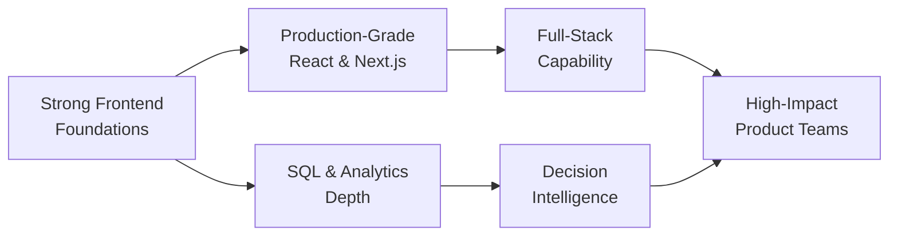

<!-- ========================= HEADER ========================= -->
<div align="center">


<br />

<!-- ===== SOCIAL BADGES ===== -->
<a href="https://myweb-aditya.vercel.app">
  
</a>
<a href="https://www.linkedin.com/in/aditya-choudhary-57a986229/">
  
</a>
<a href="mailto:adityac2606@gmail.com">
  
</a>
<a href="https://github.com/adityajat2606?tab=repositories">
  
</a>
<a href="#-lets-connect">
  
</a>

<br /><br />

<!-- ===== LIVE COUNTERS ===== -->


</div>


<!-- ========================= ABOUT ========================= -->
##  About Me


I build digital products with a **premium mindset** — every interaction feels deliberate, every layout feels clean, and every decision has purpose behind it. My work sits at the intersection of **modern frontend engineering** and **data-driven thinking**, letting me create experiences that are not only visually polished, but practical, scalable, and aligned with real user needs.

```yaml
name:      Aditya Choudhary
role:      Software Developer | Data Analyst
focus:     [ React, Next.js, TypeScript, Tailwind CSS, SQL ]
mindset:   "Design with intent. Build with precision. Ship with care."
currently: Building production-grade frontend systems
open_to:   Frontend / Full-Stack / Data Analyst roles
```

- 🎨 Designing modern interfaces with **React, Next.js, TypeScript, Tailwind CSS**
- ⚙️ Translating ideas into polished, **production-ready frontend systems**
- 📊 Using **SQL and analytics** to support smarter product and business decisions
- 🚀 Obsessed with **performance, usability, accessibility, and visual quality**

<br clear="right" />


<!-- ========================= WHAT I BRING ========================= -->
##  What I Bring

<table>
<tr>
<td width="50%" valign="top">

### 🧩 Frontend Engineering

- Interfaces that feel refined, responsive, and effortless across devices
- Component systems built for **scalability, consistency, and maintainability**
- Cleaner flows, sharper UI structure, performance-aware implementation
- A product mindset that values both **aesthetics and real usability**

</td>
<td width="50%" valign="top">

### 📈 Data & Analytics

- Writing efficient **SQL** for analysis, reporting, and business clarity
- Transforming raw data into structured, **decision-ready insight**
- Finding patterns that help products and teams move with confidence
- Supporting dashboards with a practical problem-solving approach

</td>
</tr>
</table>


<!-- ========================= TECH STACK ========================= -->
##  Tech Arsenal

<div align="center">

**Languages & Core**


**Frameworks & Libraries**


**Data, Backend & Cloud**


**Tools & Workflow**


</div>

<details>
<summary><b>🔍 Expand for proficiency breakdown</b></summary>

<br />

| Domain | Stack | Confidence |
| :--- | :--- | :--- |
| **Markup & Styling** | HTML5, CSS3, Tailwind CSS | `██████████` Advanced |
| **Languages** | JavaScript, TypeScript | `█████████░` Advanced |
| **Frameworks** | React, Next.js | `█████████░` Advanced |
| **Data & Queries** | SQL, PostgreSQL, MySQL | `████████░░` Strong |
| **Backend & Services** | Firebase, Node.js | `███████░░░` Working |
| **Tooling & Deploy** | Git, GitHub, Vercel | `█████████░` Advanced |
| **Design** | Figma, UI systems | `████████░░` Strong |

</details>


<!-- ========================= GITHUB ANALYTICS ========================= -->
##  GitHub Analytics

<div align="center">


</div>

### 📊 Contribution Activity

<div align="center">


</div>


<!-- ========================= SNAKE ========================= -->
##  Contribution Snake

<div align="center">

<picture>
  <source media="(prefers-color-scheme: dark)" srcset="https://raw.githubusercontent.com/adityajat2606/adityajat2606/output/snake-dark.svg" />
  <source media="(prefers-color-scheme: light)" srcset="https://raw.githubusercontent.com/adityajat2606/adityajat2606/output/snake.svg" />
  
</picture>

</div>


<!-- ========================= PROJECTS ========================= -->
##  Signature Work

### 🏥 Online Appointment Booking System

> A healthcare-focused platform built to simplify appointment scheduling through a cleaner experience, clearer flows, and a responsive interface designed for real-world usability.

<table>
<tr>
<td width="55%" valign="top">

**Highlights**

- ⚡ Streamlined booking journey engineered for faster user action
- 📱 Responsive frontend architecture built for accessibility and scale
- 🎯 UI patterns designed for clarity, trust, and ease of use
- 🏗️ Production-ready structure with a strong focus on user experience

</td>
<td width="45%" valign="top">

**Stack**


**Role**

Design → Architecture → Implementation → Deploy

</td>
</tr>
</table>

<div align="center">

<a href="https://github.com/adityajat2606?tab=repositories">
  
</a>

</div>


<!-- ========================= STRENGTHS ========================= -->
##  Core Strengths

<div align="center">

| | Area | Value I Bring |
| :---: | :--- | :--- |
| 🎨 | **Frontend** | Premium-feeling UI, responsive layouts, component-driven architecture |
| ⚡ | **Performance** | Smooth interaction, cleaner rendering, speed-conscious development |
| 📊 | **Analytics** | Strong SQL skills paired with practical, data-informed thinking |
| 🎯 | **Execution** | Focused delivery, thoughtful decisions, dependable implementation |
| 🤝 | **Collaboration** | Clear communication, ownership mindset, feedback-driven iteration |

</div>


<!-- ========================= DIRECTION ========================= -->
##  Current Direction



- 🔭 Building sharper, more production-ready experiences with **React and Next.js**
- 🌱 Expanding from strong frontend foundations into broader **full-stack capability**
- 📚 Strengthening **analytics and SQL depth** to pair UI quality with decision intelligence
- 💼 Looking to contribute to teams that value **craft, ownership, and meaningful impact**


<!-- ========================= CONNECT ========================= -->
##  Let's Connect

<div align="center">

**If you're building something ambitious, hiring for a strong frontend or product-minded developer, or simply want to connect — I'd be glad to talk.**

<br />

<a href="https://myweb-aditya.vercel.app">
  
</a>
<br />
<a href="https://www.linkedin.com/in/aditya-choudhary-57a986229/">
  
</a>
<br />
<a href="mailto:adityac2606@gmail.com">
  
</a>

<br /><br />


</div>

<!-- ========================= FOOTER ========================= -->
<div align="center">


<sub>Designed and built with intent by <b>Aditya Choudhary</b></sub>

</div>
